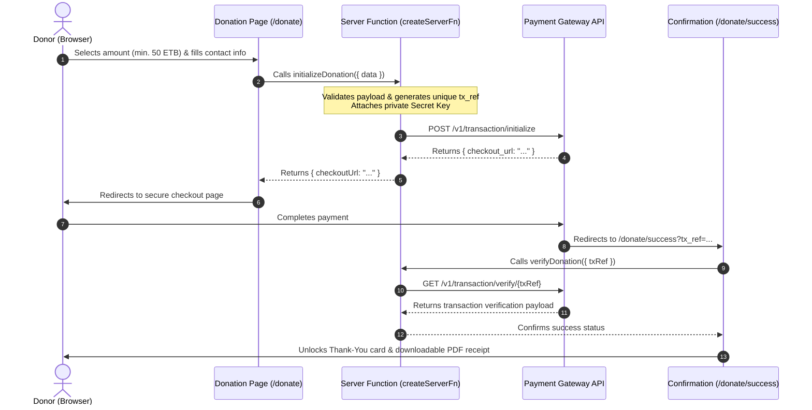

# EMWA Web Portal & Donation System

Official web platform for the **Ethiopian Media Women Association (EMWA)** — a non-profit organization dedicated to empowering women journalists, advancing press freedom, and promoting gender equality across Ethiopian media.

---

## 📖 Payment & Donation Integration

The platform includes a dedicated, secure one-time donation system supporting online checkouts and direct bank transfers.

### 1. Architecture & Security Overview

The payment system is built using **TanStack Start Server Functions (`createServerFn`)**, ensuring that sensitive API secret keys and transaction verification remain **100% server-side** and never leak to the client browser.



---

### 2. Key Files & Structure

| File | Type | Description |
|---|---|---|
| [`src/routes/donate.tsx`](file:///home/tegegn/Desktop/projects/beamlk/EMWAnew-main/src/routes/donate.tsx) | Page Route (`/donate`) | Interactive donation form, preset amount buttons (`50 ETB` – `10,000 ETB`), custom amount input, and direct bank transfer copy cards. |
| [`src/routes/donate.success.tsx`](file:///home/tegegn/Desktop/projects/beamlk/EMWAnew-main/src/routes/donate.success.tsx) | Page Route (`/donate/success`) | Return landing page that automatically verifies transaction references with the gateway and generates downloadable PDF receipts. |
| [`src/lib/donation.functions.ts`](file:///home/tegegn/Desktop/projects/beamlk/EMWAnew-main/src/lib/donation.functions.ts) | Server Functions | Server-side `initializeDonation` and `verifyDonation` handlers executed via `@tanstack/react-start`. |
| [`.env`](file:///home/tegegn/Desktop/projects/beamlk/EMWAnew-main/.env) | Environment Config | Secure storage for gateway keys (protected by `.gitignore`). |
| [`.env.example`](file:///home/tegegn/Desktop/projects/beamlk/EMWAnew-main/.env.example) | Environment Template | Reference template for deployment. |

---

### 3. Environment Variables Configuration

Create a `.env` file in the project root:

```env
# Base Application URL
APP_BASE_URL=http://localhost:5173

# Payment Gateway Keys
VITE_CHAPA_PUBLIC_KEY=CHAPUBK_TEST-xxxxxxxxxxxxxxxxxxxx
CHAPA_SECRET_KEY=CHASECK_TEST-xxxxxxxxxxxxxxxxxxxx

# Optional: Webhook Secret Hash for signature verification
CHAPA_WEBHOOK_SECRET=your_custom_webhook_secret

# External Backend API URL
VITE_API_URL=https://api.ethmwa.org/api/v1
```

> [!IMPORTANT]
> - `CHAPA_SECRET_KEY` must **never** have the `VITE_` prefix so it remains strictly on the server.
> - `.env` is included in `.gitignore` to prevent secret keys from being pushed to version control.

---

### 4. How Payment Validation Works

1. **Client-Side Validation**:
   - Enforces a minimum donation threshold of **50 ETB**.
   - Validates required fields (First Name, Last Name, Email).
2. **Server-Side Initialization**:
   - Re-verifies all input parameters.
   - Generates a unique, tamper-proof reference ID:
     ```ts
     const txRef = `EMWA-DONATION-${Date.now()}-${Math.random().toString(36).substring(2, 7).toUpperCase()}`;
     ```
   - Sends the request to the gateway using `Authorization: Bearer ${CHAPA_SECRET_KEY}`.
3. **Cryptographic Return Verification**:
   - The `/donate/success` page reads `tx_ref` from query parameters and calls `verifyDonation({ data: { txRef } })`.
   - Makes a direct server-to-server call: `GET /v1/transaction/verify/${txRef}`.
   - The UI unlocks the **Download Receipt (PDF)** button only when the gateway confirms `status === "success"`.

---

### 5. Local Development & Testing

1. **Install dependencies**:
   ```bash
   npm install
   ```
2. **Start the development server**:
   ```bash
   npm run dev
   ```
3. **Test the flow**:
   - Navigate to `http://localhost:5173/donate`.
   - Select an amount (e.g. `100 ETB` or `2,500 ETB`).
   - Enter test donor details and click **Donate ETB**.
   - You will be redirected to the secure payment sandbox to complete the transaction.
   - Upon completion, you will be redirected to `/donate/success` to view and download the official PDF receipt.

---

### 6. Production Deployment Checklist

When deploying to live production:
1. Replace `CHASECK_TEST-...` and `CHAPUBK_TEST-...` with your live production keys (`CHASECK_LIVE-...` and `CHAPUBK_LIVE-...`) in your hosting environment variables (e.g., Cloudflare Pages, Vercel, Netlify, or VPS).
2. Update `APP_BASE_URL` to your production domain: `https://ethmwa.org`.
3. Verify that the return and callback URLs point to `https://ethmwa.org/donate/success`.